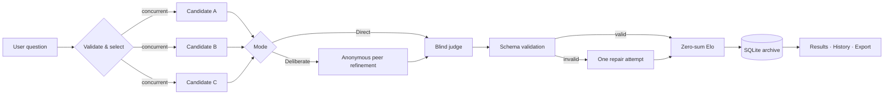

<div align="center">



<br>

[](https://github.com/Senaaravichandran/Jurex/actions/workflows/ci.yml)
[](https://www.python.org/)
[](https://fastapi.tiangolo.com/)
[](Dockerfile)
[](LICENSE)

**A production-minded arena where multiple language models reason in parallel, deliberate over anonymous peer drafts, and face a blind structured judge.**

[Quick start](#quick-start) · [How it works](#how-delibra-reaches-a-verdict) · [API](#api) · [Deploy](#deployment) · [Contribute](CONTRIBUTING.md)

</div>

---

## Why Delibra?

One model can sound confident and still be wrong. Delibra turns a question into an inspectable competition: independent answers, an optional synthesis round, anonymous evaluation, durable evidence, and ratings that evolve with every result.

The name blends **deliberation** with **libra**, the scales of balance—multiple perspectives weighed carefully before a verdict is reached.

### What makes it different

- **Parallel by default** — 2–4 candidates run concurrently behind bounded provider clients.
- **Real deliberation** — models can revise their answers using anonymized peer drafts.
- **Blind evaluation** — the judge sees `candidate-A`, not a model brand.
- **Validated verdicts** — strict schemas, full-candidate checks, consecutive ranks, and one repair attempt.
- **Graceful partial failure** — one provider can fail without collapsing the entire council.
- **Fair multiplayer Elo** — every ranking becomes zero-sum pairwise outcomes calculated from one pre-debate snapshot.
- **Durable history** — debates, answers, timings, verdicts, and ratings survive restarts in SQLite.
- **Complete product surface** — responsive frontend, versioned API, exports, OpenAPI, security headers, tests, CI, and Docker.

## How Delibra reaches a verdict



The judge uses a weighted rubric: **correctness 45%**, **completeness 25%**, **clarity 20%**, and **concision 10%**. Candidate text is explicitly treated as untrusted data to reduce instruction-injection risk during evaluation.

## Feature map

| Layer | Included |
|---|---|
| Arena | Async parallel calls, concurrency bounds, timeouts, exponential retry, partial results |
| Deliberation | Direct and two-round modes, anonymous peer context, standalone final answers |
| Judging | Brand-blind candidates, JSON mode, strict validation, safe repair, weighted rubric |
| Ratings | Multiplayer pairwise Elo, order-independent deltas, durable wins/debate counts |
| Backend | FastAPI, background debate jobs, polling, pagination, search, exports, OpenAPI |
| Frontend | Responsive dark interface, live status/stats, model council, verdict cards, archive |
| Persistence | SQLite WAL, transactional debate + rating writes, indexed history |
| Hardening | Optional API key, constant-time comparison, rate limit, CSP, request IDs, safe errors |
| Operations | Non-root Docker image, health check, persistent volume, CI across Python 3.11/3.13 |

## Quick start

### 1. Clone and install

```bash
git clone https://github.com/Senaaravichandran/Jurex.git
cd Jurex

python -m venv .venv

# Windows
.venv\Scripts\activate

# macOS / Linux
source .venv/bin/activate

python -m pip install -r requirements.txt
```

### 2. Configure providers

```bash
# Windows PowerShell
Copy-Item .env.example .env

# macOS / Linux
cp .env.example .env
```

Add credentials to `.env`. At least **two available candidate models** are required.

| Variable | Enables | Provider console |
|---|---|---|
| `GROQ_API_KEY` | Qwen 3.6 27B and GPT-OSS 120B candidates; GPT-OSS is the default judge | [Groq Console](https://console.groq.com/) |
| `NVIDIA_API_KEY` | Nemotron 3.5 Lightning and GPT-OSS 20B | [NVIDIA Build](https://build.nvidia.com/) |
| `NVIDIA_OPENAI_API_KEY` | Backward-compatible GPT-OSS credential | [NVIDIA Build](https://build.nvidia.com/) |

Model routes are environment-driven. Change IDs in `.env` when a provider retires or replaces a model—no source edit required.

### 3. Run

```bash
python -m uvicorn delibra.main:app --host 0.0.0.0 --port 8000 --reload
```

Open [http://localhost:8000](http://localhost:8000). Interactive API documentation is at [http://localhost:8000/api/docs](http://localhost:8000/api/docs).

## API

Every debate is an asynchronous job. Creation returns `202 Accepted`; poll the returned ID until its status becomes `completed`, `partial`, or `failed`.

```bash
curl -X POST http://localhost:8000/api/v1/debates \
  -H "Content-Type: application/json" \
  -d '{
    "question": "When should a team choose event sourcing over CRUD?",
    "model_ids": ["qwen-3.6-27b", "nemotron-3.5-lightning", "gpt-oss-20b"],
    "mode": "deliberate"
  }'
```

```bash
curl http://localhost:8000/api/v1/debates/<debate-id>
```

| Method | Route | Purpose |
|---|---|---|
| `GET` | `/api/v1/health` | Runtime, database, and provider readiness |
| `GET` | `/api/v1/models` | Public model catalog and availability |
| `POST` | `/api/v1/debates` | Queue a validated debate |
| `GET` | `/api/v1/debates` | Paginated, searchable archive |
| `GET` | `/api/v1/debates/{id}` | Full answers, verdict, usage, timings, ratings |
| `GET` | `/api/v1/debates/{id}/export` | Download Markdown or JSON evidence |
| `GET` | `/api/v1/stats` | Leaderboard and arena totals |

If `DELIBRA_API_KEY` is set, include it on creation requests:

```bash
-H "X-API-Key: your-deployment-secret"
```

The browser UI reveals an access-key field automatically on protected deployments and stores the key only in that tab's session storage.

## Configuration

| Setting | Default | Notes |
|---|---:|---|
| `DELIBRA_ENVIRONMENT` | `development` | Use `production` in deployed environments |
| `DELIBRA_DATABASE_PATH` | `data/delibra.db` | Parent directory is created automatically |
| `DELIBRA_REQUEST_TIMEOUT_SECONDS` | `60` | Per-provider request ceiling, 5–300 seconds |
| `DELIBRA_MAX_CONCURRENT_MODELS` | `4` | Process-local concurrency bound |
| `DELIBRA_MAX_QUESTION_LENGTH` | `12000` | Applied at API and service boundaries |
| `DELIBRA_RATE_LIMIT_PER_MINUTE` | `10` | Debate creations per client and process |
| `DELIBRA_API_KEY` | empty | Optional protection for write requests |
| `DELIBRA_JUDGE_MODEL_ID` | `gpt-oss-120b` | Falls back to the first available model |
| `DELIBRA_CORS_ORIGINS` | local app origins | Comma-separated exact origins |

See [.env.example](.env.example) for the complete configuration surface.

## Architecture

```text
delibra/
└── main.py         # Public ASGI and command-line entry point

verdictforge/       # Stable core-engine namespace
├── api.py          # Versioned HTTP routes and export formats
├── arena.py        # Concurrent answer and refinement rounds
├── catalog.py      # Public model registry and availability
├── config.py       # Typed environment configuration
├── judging.py      # Blind evaluation, parsing, and repair
├── main.py         # Application factory and lifecycle
├── middleware.py   # Auth, rate limit, telemetry, browser headers
├── providers.py    # Async OpenAI-compatible provider adapters
├── ratings.py      # Pure multiplayer Elo calculations
├── repository.py   # Transactional async SQLite repository
├── schemas.py      # Strict domain and API contracts
├── service.py      # Debate lifecycle orchestration
└── web/             # Framework-free responsive frontend
```

The provider boundary uses the OpenAI-compatible protocol, so another compatible endpoint can be added by extending the catalog and registry without changing the arena, judge, persistence, or UI contracts.

## Quality and testing

The suite never spends provider credits. Fakes exercise concurrency, partial failure, blind identity restoration, judge validation, Elo invariants, persistence, API behavior, authentication, and static delivery.

```bash
python -m pip install -r requirements-dev.txt
python -m ruff check .
python -m ruff format --check .
python -m pytest --cov=verdictforge --cov-report=term-missing
node --check verdictforge/web/app.js
```

Current local verification: **19 tests passing**, **79% aggregate backend coverage**, and a successful live three-provider verdict. GitHub Actions repeats lint, format, and coverage runs on Python 3.11 and 3.13.

## Deployment

### Docker Compose

```bash
cp .env.example .env
# Add provider keys to .env
docker compose up --build -d
docker compose ps
```

The container runs as an unprivileged user, exposes port `8000`, performs an HTTP health check, and stores SQLite state in the `delibra-data` volume.

### Production boundary

This repository is deployment-ready for a **single application instance**. Debate jobs and rate limits are process-local, while SQLite is the durable store; the supplied container therefore uses one worker. For horizontal scale, replace background tasks with a durable queue, move persistence to PostgreSQL, and enforce limits at the gateway. The service, schema, and provider boundaries are intentionally separated to make that migration straightforward.

## Security notes

- Secrets load from environment variables and `.env` is ignored by Git.
- Provider exception details are logged server-side but reduced to safe client messages.
- Candidate content is delimited and treated as untrusted during refinement and judging.
- Authentication uses constant-time secret comparison when enabled.
- Responses include CSP, anti-framing, MIME-sniffing, referrer, and permissions policies.
- Request IDs make user-visible failures traceable without exposing credentials.

Please report vulnerabilities privately using the guidance in [SECURITY.md](SECURITY.md).

## Roadmap

- Server-sent event progress and token streaming
- PostgreSQL repository and durable distributed worker
- Pluggable Anthropic, Gemini, Mistral, and local Ollama adapters
- Human voting blended with judge confidence
- Evaluation datasets, rubric templates, and longitudinal charts
- Organization accounts and role-scoped API keys

## Contributing

Thoughtful issues and pull requests are welcome. Read [CONTRIBUTING.md](CONTRIBUTING.md) for the development workflow and quality bar.

Built by **Sena**. Released under the [MIT License](LICENSE).

<div align="center">

**Ask better questions. Demand inspectable answers.**

</div>
